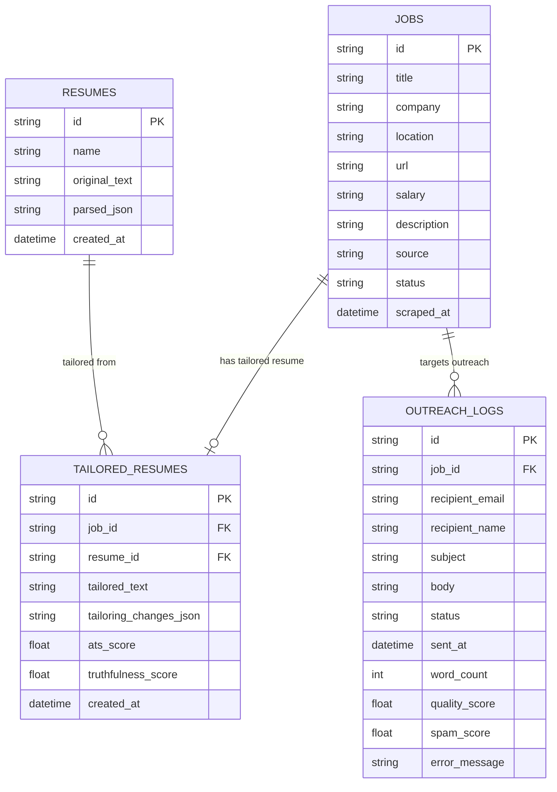
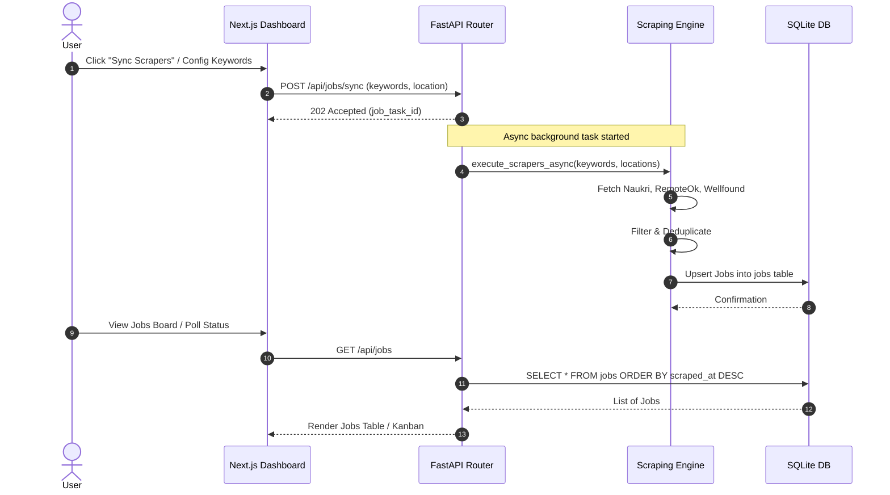
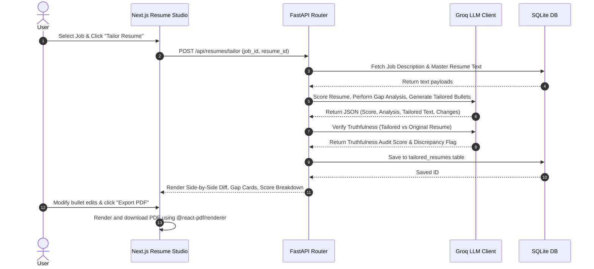
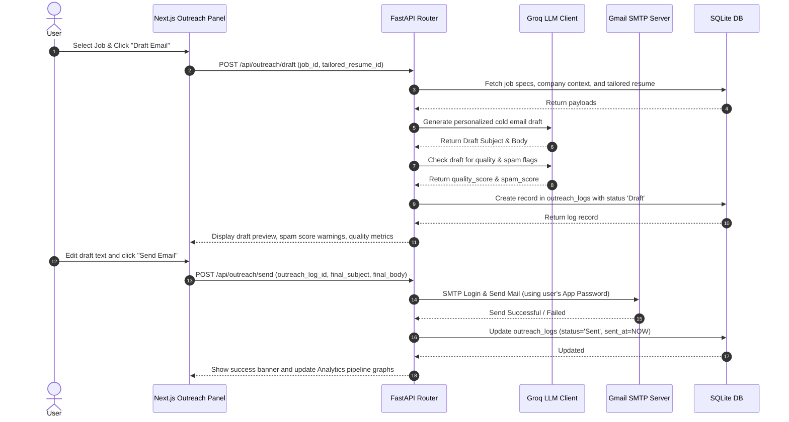

# Detailed Architecture Specification: JobFlow AI

This document provides a detailed technical architecture and implementation blueprint for **JobFlow AI**, a unified platform that integrates job scraping, AI-powered resume tailoring, and automated cold email outreach.

---

## 1. System Overview

JobFlow AI is structured as a decoupled web application comprising a high-performance Python FastAPI backend, a responsive React Next.js frontend, and a shared SQLite relational database.

```
+---------------------------------------------------------------------------------+
|                                 CLIENT LAYER                                    |
|                                                                                 |
|                   Next.js Web UI (Dashboard, Studio, Outreach)                  |
|                                        |                                        |
+----------------------------------------|----------------------------------------+
                                         | HTTP / JSON
                                         v
+---------------------------------------------------------------------------------+
|                                  API GATEWAY                                    |
|                                                                                 |
|                               FastAPI Service                                   |
|   +-------------------+  +--------------------+  +--------------------------+   |
|   |   Jobs Router     |  |   Resumes Router   |  |     Outreach Router      |   |
|   +-------------------+  +--------------------+  +--------------------------+   |
+-------------|----------------------|----------------------|---------------------+
              |                      |                      |
              v                      v                      v
+---------------------------------------------------------------------------------+
|                                CORE ENGINE                                      |
|                                                                                 |
|   +-------------------+  +--------------------+  +--------------------------+   |
|   |  Scraper Registry |  |  Resume Tailor &   |  |   Email Generator &      |   |
|   |  (Naukri, etc.)   |  |  ATS Match Scorer  |  |   SMTP Sender (Gmail)    |   |
|   +-------------------+  +--------------------+  +--------------------------+   |
+-------------|----------------------|----------------------|---------------------+
              |                      |                      |
              +----------------------+----------------------+
                                     |
                                     v
+---------------------------------------------------------------------------------+
|                              DATA & INFRASTRUCTURE                              |
|                                                                                 |
|    +------------------------+             +-------------------------------+     |
|    |   SQLite Database      |             |         External APIs         |     |
|    |   (Shared Schema)      |             |   - Groq API (LLM)            |     |
|    +------------------------+             |   - Firecrawl API (Scraping)  |     |
|                                           +-------------------------------+     |
+---------------------------------------------------------------------------------+
```

### Key Design Decisions
1. **API Centralization in FastAPI (Python)**:
   * **Why**: The scrapers ([main.py](file:///c:/Users/adm/Desktop/job-agent/main.py)) and outreach sender ([gmail_sender.py](file:///c:/Users/adm/Desktop/cold_email_parser/phase3/gmail_sender.py)) are Python-based. Rather than re-writing them in TypeScript or spawning Python processes from Next.js, we wrap them in a FastAPI backend.
   * **Timeout Relief**: Next.js Serverless Functions on Vercel have a 10-second timeout on the hobby plan. LLM calls for resume tailoring, gap analysis, and email validation often take 12-25 seconds. Placing these processes in FastAPI running on a persistent host (e.g., Fly.io, Render, or Docker container) resolves serverless timeout limitations.
2. **Client Dashboard in Next.js (React)**:
   * **Why**: Provides a high-fidelity SPA dashboard using React, Tailwind CSS, and Zustand (leveraging components from [resume-shapeshifter](file:///c:/Users/adm/Desktop/Resume_builder_AI_Project/resume-shapeshifter)). It manages client states and leverages client-side libraries like `@react-pdf/renderer` for instant, local PDF generation.
3. **Unified SQLite Relational Database**:
   * **Why**: Eliminates scattered CSV tracking sheets. Provides clean constraints, foreign keys, transaction safety, and instant query execution for local/single-user deployments.

---

## 2. Directory Structure

The unified workspace will be organized as a monorepo in the following structure:

```
Final Project/
├── docs/
│   ├── ProblemStatement.md
│   └── DetailedArchitecture.md
├── backend/                  # Python FastAPI Project
│   ├── app/
│   │   ├── api/              # Routers (endpoints)
│   │   │   ├── jobs.py
│   │   │   ├── resumes.py
│   │   │   └── outreach.py
│   │   ├── core/             # Configuration and DB models
│   │   │   ├── config.py
│   │   │   ├── database.py   # SQLAlchemy session manager
│   │   │   └── models.py     # Unified DB schema models
│   │   ├── services/         # Core business logic
│   │   │   ├── scrapers/     # Ported scrapers (Naukri, RemoteOk, Wellfound)
│   │   │   ├── tailor/       # Ported scoring, tailoring, & truthfulness logic
│   │   │   └── outreach/     # Ported email gen, spam checker, SMTP sender
│   │   └── main.py           # FastAPI Application Entry
│   ├── tests/                # Ported Python tests
│   ├── requirements.txt
│   └── Dockerfile
├── frontend/                 # Next.js TypeScript Project (Ported from Resume Builder)
│   ├── src/
│   │   ├── app/              # Next.js App Router (Pages: Dashboard, Studio, Outreach)
│   │   ├── components/       # UI Components (Radix UI / custom CSS)
│   │   ├── lib/              # Client API wrappers & helper methods
│   │   └── store/            # Zustand state stores
│   ├── package.json
│   └── next.config.ts
└── docker-compose.yml        # Orchestrates Local Dev Backend & DB
```

---

## 3. Unified Database Schema

The SQLite database (`jobflow.db`) is managed by Python's **SQLAlchemy ORM** and migrates historical records from `jobs.csv` and `outreach_log.csv`.



### JSON Schema Formats
To preserve structured LLM representations in SQLite, we use JSON columns for:
* **`resumes.parsed_json`**:
  ```json
  {
    "contact": { "name": "John Doe", "email": "johndoe@email.com", "phone": "123456" },
    "skills": ["Python", "Next.js", "SQL", "LLMs"],
    "experience": [
      {
        "role": "Software Engineer",
        "company": "TechCorp",
        "duration": "2024 - Present",
        "bullets": ["Developed scraping APIs saving 50 hours of work.", "Maintained Next.js site."]
      }
    ],
    "education": [{ "degree": "B.S. Computer Science", "school": "State Uni" }]
  }
  ```
* **`tailored_resumes.tailoring_changes_json`**:
  ```json
  {
    "score_gain": 25.0,
    "bullet_changes": [
      {
        "original_index": 0,
        "original_text": "Developed scraping APIs saving 50 hours of work.",
        "tailored_text": "Architected Python/asyncio BeautifulSoup scraping pipelines processing 10k items daily, improving retrieval speed by 40%.",
        "rationale": "Aligned with the job description request for asyncio and high-scale scraping performance."
      }
    ]
  }
  ```

---

## 4. Execution Data Flows

### A. Job Aggregation Flow
This flow details how the system triggers background scraping and updates the listings:



### B. Resume Tailoring Flow
This flow details the transition of data when tailoring a candidate's resume for a specific job post:



### C. Outreach Email Generation & SMTP Dispatch Flow
This flow details email generation, spam analysis, and delivery:



---

## 5. REST API Specifications

The FastAPI backend exposes the following endpoints:

### Jobs Endpoints
* **`GET /api/jobs`**: Retrieves all job listings.
  * *Parameters*: `status` (filter), `source` (filter), `search` (query string).
* **`POST /api/jobs/sync`**: Trigger background scrapers.
  * *Body*: `{"keywords": ["Python", "Next.js"], "location": "Bangalore"}`
  * *Response*: `{"status": "processing", "task_id": "abc-123"}`
* **`DELETE /api/jobs/{job_id}`**: Mark a job as archived/deleted.

### Resume Endpoints
* **`POST /api/resumes/upload`**: Uploads and parses a new master resume.
  * *Body*: Multipart Form (PDF / MD file).
  * *Response*: `{"resume_id": "res-987", "name": "John_Doe_CV.pdf"}`
* **`POST /api/resumes/tailor`**: Creates tailored content for a specific job.
  * *Body*: `{"job_id": "job-456", "resume_id": "res-987"}`
  * *Response*: 
    ```json
    {
      "tailored_resume_id": "tailored-001",
      "ats_score": 85,
      "truthfulness_score": 98,
      "gap_analysis": { "strengths": [], "weaknesses": [], "gaps": [] },
      "bullet_changes": []
    }
    ```
* **`PUT /api/resumes/tailored/{tailored_id}`**: Manually updates tailored text.

### Outreach Endpoints
* **`POST /api/outreach/draft`**: Generates a cold email proposal.
  * *Body*: `{"job_id": "job-456", "tailored_resume_id": "tailored-001"}`
  * *Response*: `{"outreach_id": "out-111", "subject": "...", "body": "...", "spam_score": 0.1}`
* **`POST /api/outreach/send`**: Sends the draft via SMTP.
  * *Body*: `{"outreach_log_id": "out-111", "subject": "...", "body": "..."}`
  * *Response*: `{"status": "sent", "sent_at": "2026-06-07T09:00:00Z"}`
* **`GET /api/outreach/analytics`**: Computes funnels and conversion charts.

---

## 6. Environment Configurations (`.env`)

Create a unified `.env` file in the root directory. Never commit secrets to the git repository.

```ini
# Core Configuration
ENVIRONMENT=development
DATABASE_URL=sqlite:///./jobflow.db

# LLM Orchestrator Credentials
GROQ_API_KEY=gsk_your_groq_api_key_here

# Scraping API Keys
FIRECRAWL_API_KEY=fc-your-firecrawl-key-here

# Email Delivery credentials
SMTP_HOST=smtp.gmail.com
SMTP_PORT=587
SMTP_USER=your-email@gmail.com
SMTP_PASSWORD=xxxx-xxxx-xxxx-xxxx # 16-character Gmail App Password
SENDER_NAME="Your Full Name"
DRY_RUN=True # Toggle to False to start sending real emails
```

---

## 7. Logging, Resilience, and Monitoring

To maintain the operational stability defined in [MONITORING.md](file:///c:/Users/adm/Desktop/job-agent/MONITORING.md), JobFlow AI implements three pillars of resilience:

### A. Logging Strategy
All system logs are written to a centralized file `logs/jobflow.log` and split into three channels:
1. **`jobflow.scrapers`**: Tracks scraping duration, rate-limiting HTTP headers (429s), and network connection retry indicators.
2. **`jobflow.llm`**: Tracks payload token size, response latency, and rate-limits of the Groq API client.
3. **`jobflow.outreach`**: Records SMTP transaction payloads, connection timeouts, and delivery response headers.

### B. LLM & API Retry Engine
Groq API and Firecrawl requests are wrapped in a retry handler with exponential backoff:
```python
import time
import httpx
from httpx import HTTPStatusError

def call_with_retry(func, *args, max_retries=3, initial_delay=2, **kwargs):
    delay = initial_delay
    for attempt in range(max_retries):
        try:
            return func(*args, **kwargs)
        except HTTPStatusError as e:
            if e.response.status_code == 429: # Rate limit
                time.sleep(delay)
                delay *= 2
                continue
            raise e
```

### C. SMTP Sandbox (Dry-Run Mode)
When `DRY_RUN=True` is enabled, the system bypasses the SMTP socket server entirely. 
* Mail payloads are checked for errors, validated, logged to the SQLite database with status `'Simulated'`, and written to local preview files at `logs/simulated_emails/` for inspection before sending real outreach.
