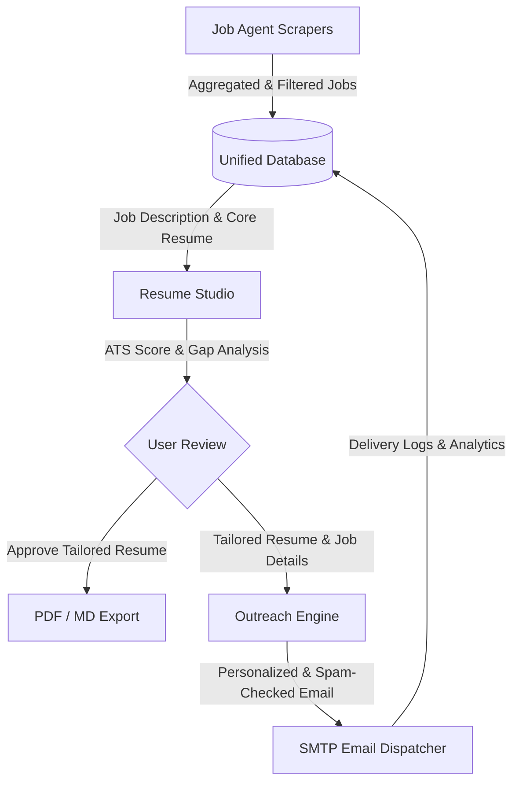

# Problem Statement: Unified Career Automation Platform (JobFlow AI)

## 1. Executive Summary

Modern job hunting is fragmented, inefficient, and manual. Job seekers are forced to navigate multiple isolated tools to find job listings, customize their resumes, and reach out to hiring managers. 

This document outlines the design and integration plan for **JobFlow AI**, a unified career automation suite. JobFlow AI combines three previously independent tools into a single, cohesive, web-based platform:
1. **Job Agent**: A background scraping and aggregation tool.
2. **Resume Builder (Resume Shapeshifter)**: An AI-driven resume scoring, gap-analysis, and tailoring assistant.
3. **Cold Email Parser (The Closer)**: An automated cold email personalizer, quality validator, and SMTP outreach engine.

By unifying these projects, we create a seamless end-to-end workflow: **Discover -> Tailor -> Reach Out -> Track**.

---

## 2. The Core Problem & Opportunity

### The Fragmented Job Application Lifecycle
Currently, job seekers perform the following steps across disconnected interfaces:
1. **Manual / Scattered Discovery**: Reviewing multiple job boards (Naukri, Wellfound, RemoteOk, etc.), resulting in duplicate views, manual spreadsheet logging, and missed listings.
2. **Generic Resumes**: Submitting identical resumes for different roles, leading to low applicant tracking system (ATS) scores and high rejection rates. Manual customization per job is tedious and time-consuming.
3. **Impersonal Outreach**: Sending identical cold emails to hiring managers or recruiters, resulting in high spam rates and low response rates. Crafting custom, high-converting outreach messages for dozens of applications is unsustainable.
4. **Zero State Visibility**: Tracking the progress of discovery, customization, and email outreach in disparate sheets or logs with no centralized analytics or funnel metrics.

### The Solution: An End-to-End Automation Pipeline
By combining our three systems into **JobFlow AI**, we establish a single control center that automates the transition between each stage of the application lifecycle:



---

## 3. Analysis of Existing Codebases

To successfully build the platform, we must review the components, files, and technologies of the three existing repositories:

### A. Job Aggregator ([Job Agent](file:///c:/Users/adm/Desktop/job-agent))
* **Objective**: Automates scraping of job listings from multiple sources, removes duplicates, filters by keywords, and logs listings to CSV.
* **Stack**: Python, CLI, BeautifulSoup, requests, Firecrawl API, pytest.
* **Core Components**:
  - [main.py](file:///c:/Users/adm/Desktop/job-agent/main.py): CLI wrapper and orchestration script.
  - [naukri_scraper.py](file:///c:/Users/adm/Desktop/job-agent/scrapers/naukri_scraper.py): Scrapes Indian job market using BeautifulSoup, handling cookies and simple rate limits.
  - [remoteok_scraper.py](file:///c:/Users/adm/Desktop/job-agent/scrapers/remoteok_scraper.py): Fetches remote job opportunities using RemoteOk's public JSON API.
  - [wellfound_scraper.py](file:///c:/Users/adm/Desktop/job-agent/scrapers/wellfound_scraper.py): Leverages Firecrawl to parse complex, client-side rendered startup jobs.
  - [job_filter.py](file:///c:/Users/adm/Desktop/job-agent/utils/job_filter.py): Deduplicates listings and applies keyword inclusion/exclusion rules.
  - [MONITORING.md](file:///c:/Users/adm/Desktop/job-agent/MONITORING.md): Details logging in `job_agent.log`, health checking, and local caching.

### B. Resume Customizer ([Resume Builder / Resume Shapeshifter](file:///c:/Users/adm/Desktop/Resume_builder_AI_Project))
* **Objective**: Analyzes job descriptions (JDs) against a master resume, evaluates ATS compatibility, detects unsupported claims, rewrites resume bullet points, and generates tailored PDFs.
* **Stack**: Next.js App Router, TypeScript, Tailwind CSS, Zustand (state management), Groq LLM API, `@react-pdf/renderer`.
* **Core Components**:
  - [tailoring-store.ts](file:///c:/Users/adm/Desktop/Resume_builder_AI_Project/resume-shapeshifter/src/store/tailoring-store.ts): Global client state containing original resume, parsed JD, gap analysis, and tailored bullet point drafts.
  - [scoring.ts](file:///c:/Users/adm/Desktop/Resume_builder_AI_Project/resume-shapeshifter/src/lib/scoring.ts): Computes match scores and details strengths, weaknesses, and key skill gaps.
  - [truthfulness.ts](file:///c:/Users/adm/Desktop/Resume_builder_AI_Project/resume-shapeshifter/src/lib/truthfulness.ts): Ensures tailored bullets do not hallucinate metrics or skills unsupported by the master resume.
  - [BulletRewriter.tsx](file:///c:/Users/adm/Desktop/Resume_builder_AI_Project/resume-shapeshifter/src/components/BulletRewriter.tsx): React component providing interface for reviewing and manually modifying AI-tailored bullets.
  - [pdf-generator.ts](file:///c:/Users/adm/Desktop/Resume_builder_AI_Project/resume-shapeshifter/src/lib/pdf-generator.ts): Generates professional, ATS-friendly PDF versions of the tailored resume.

### C. Outreach & Delivery ([Cold Email Parser / The Closer](file:///c:/Users/adm/Desktop/cold_email_parser))
* **Objective**: Automatically drafts context-aware outreach emails, reviews quality, checks for spam characteristics, sends them via SMTP, and displays dashboard analytics.
* **Stack**: Python, Streamlit, SQLite (`cold_email_bot.db`), Groq, SMTP (Gmail App Passwords), pytest.
* **Core Components**:
  - [streamlit_app.py](file:///c:/Users/adm/Desktop/cold_email_parser/phase4/streamlit_app.py): The main Streamlit dashboard containing data upload (CSV/JSON), SMTP setup, email generation controls, and analytics diagrams.
  - [database.py](file:///c:/Users/adm/Desktop/cold_email_parser/phase4/database.py): Handles schema creation, contact insertion, email log updates, and statistics aggregation.
  - [gmail_sender.py](file:///c:/Users/adm/Desktop/cold_email_parser/phase3/gmail_sender.py): Dispatches emails using SMTP connection pools, tracking sent/failed states.
  - [quality_scorer.py](file:///c:/Users/adm/Desktop/cold_email_parser/phase3/quality_scorer.py): Evaluates readability, tone, and personalization levels of generated emails.
  - [spam_checker.py](file:///c:/Users/adm/Desktop/cold_email_parser/phase3/spam_checker.py): Checks drafts against known spam triggers and formatting guidelines.

---

## 4. Platform Integration Vision: "JobFlow AI"

The target platform will combine the individual services into a unified application.

### Integrated Functional Architecture
1. **Aggregator Engine (Backend)**: Periodically runs scraping scripts as background worker processes. Discovered jobs are saved directly to the database rather than written to CSVs.
2. **Dashboard (Frontend)**: A unified Web UI showing:
   - **Discover Page**: A real-time kanban board or table listing scraped jobs, complete with filters, keyword customization, and quick-actions (e.g., "Discard", "Tailor Resume", "Mark Applied").
   - **Resume Studio**: Allows uploading a master resume and dynamically compares it to any saved job listing. Features a side-by-side gap analysis, bullet editor, truthfulness evaluator, and instant PDF download.
   - **Outreach Console**: Pulls job listings, tailored resumes, and company profiles to generate highly personalized emails. Includes interactive edit panels, quality scoring, dry-run toggles, and SMTP send buttons.
   - **Analytics & Funnel**: A visual pipeline showing conversion metrics (Jobs Scraped -> Resumes Tailored -> Emails Sent -> Responses Received).
3. **Database (Shared Storage)**: Replaces the CSV databases and disconnected SQLite files with a unified database schema.

---

## 5. Technical Architecture Plan

We propose a modern, robust architecture that leverages the strengths of all three original codebases:

```
                  +----------------------------------------------+
                  |               Web Web App (UI)               |
                  |                (Next.js + TS)                |
                  +-------+------------------------------^-------+
                          |                              |
                          | (REST API Calls)             | (Fetch Jobs, Scores, Logs)
                          v                              |
                  +-------v------------------------------+-------+
                  |              Backend Service                 |
                  |             (FastAPI / Python)               |
                  +-------+------------------------------^-------+
                          |                              |
                          | (Trigger Scrape / Email)     | (Update Tables)
                          v                              |
                  +-------v------------------------------+-------+
                  |         Background Workers & DB              |
                  |  - SQLite (Unified DB)                       |
                  |  - Scrapers (BeautifulSoup, Firecrawl)       |
                  |  - Email Workers (SMTP, Groq)                |
                  +----------------------------------------------+
```

### A. Core Tech Stack
* **Frontend**: Next.js (TypeScript) + Vanilla CSS/Tailwind (using modern components from `Resume Builder` like Radix UI / shadcn).
* **Backend API & Orchestration**: FastAPI (Python). 
  - Why? The scraping utilities (`Job Agent`) and the SMTP outreach/database engines (`The Closer`) are written in Python. Wrapping them in a FastAPI backend makes it straightforward to expose endpoints to the Next.js frontend while retaining the existing Python scraping libraries.
* **Database**: SQLite (Unified Database).
  - Why? It is lightweight, requires no external dependencies, and integrates cleanly with Python's SQLite adapters and Prisma/SQLAlchemy.
* **LLM Engine**: Groq API (integrated at the backend layer for both email generation and resume scoring/tailoring).

### B. Unified Schema Design (SQLite)
We will unify data storage by replacing isolated CSV files (`jobs.csv`, `outreach_log.csv`) and separate databases with the following schema:

```sql
-- Jobs table (aggregated by scrapers)
CREATE TABLE jobs (
    id TEXT PRIMARY KEY,
    title TEXT NOT NULL,
    company TEXT NOT NULL,
    location TEXT,
    url TEXT UNIQUE NOT NULL,
    salary TEXT,
    description TEXT,
    source TEXT NOT NULL,          -- 'Naukri', 'Wellfound', 'RemoteOk'
    status TEXT DEFAULT 'New',     -- 'New', 'Tailored', 'Applied', 'Rejected'
    scraped_at DATETIME DEFAULT CURRENT_TIMESTAMP
);

-- Master Resumes table
CREATE TABLE resumes (
    id TEXT PRIMARY KEY,
    name TEXT NOT NULL,
    original_text TEXT NOT NULL,
    parsed_json TEXT,              -- Structural parsed content
    created_at DATETIME DEFAULT CURRENT_TIMESTAMP
);

-- Tailored Resumes table (linked to specific jobs)
CREATE TABLE tailored_resumes (
    id TEXT PRIMARY KEY,
    job_id TEXT NOT NULL,
    resume_id TEXT NOT NULL,
    tailored_text TEXT NOT NULL,
    tailoring_changes TEXT,        -- JSON showing bullet-point diffs
    ats_score REAL,
    truthfulness_score REAL,
    created_at DATETIME DEFAULT CURRENT_TIMESTAMP,
    FOREIGN KEY(job_id) REFERENCES jobs(id),
    FOREIGN KEY(resume_id) REFERENCES resumes(id)
);

-- Outreach Logs table (replacing CSV/old database)
CREATE TABLE outreach_logs (
    id TEXT PRIMARY KEY,
    job_id TEXT NOT NULL,
    recipient_email TEXT NOT NULL,
    recipient_name TEXT,
    subject TEXT NOT NULL,
    body TEXT NOT NULL,
    status TEXT NOT NULL,          -- 'Draft', 'Pending', 'Sent', 'Failed'
    sent_at DATETIME,
    word_count INTEGER,
    quality_score REAL,
    spam_score REAL,
    error_message TEXT,
    FOREIGN KEY(job_id) REFERENCES jobs(id)
);
```

---

## 6. Detailed Integration Flow (Step-by-Step)

Here is how a single applicant transitions through the integrated system:

1. **Discovery Phase**:
   - The user schedules a scraping job from the dashboard.
   - The FastAPI backend triggers [main_async.py](file:///c:/Users/adm\Desktop/job-agent/main_async.py).
   - Scrapers extract matching listings and upsert them into the database (`jobs` table).
   - The frontend updates to show new listings.

2. **Customization Phase**:
   - The user clicks **"Tailor Resume"** next to a job listing on the dashboard.
   - The Next.js client initiates a request to the backend.
   - The backend runs `scoring.ts` / `tailor.ts` via the LLM API to evaluate the master resume against the chosen job's description.
   - The user reviews the side-by-side comparison inside `BulletRewriter.tsx`, amends edits, verifies truthfulness via `truthfulness.ts`, and exports the tailored PDF via `pdf-generator.ts`.
   - The tailored version is stored in `tailored_resumes` linked to the job ID.

3. **Outreach Phase**:
   - The user selects **"Start Outreach"** for the application.
   - The system retrieves the job details and the tailored resume text.
   - The cold email generator drafts an email using target contact details (scraped or manually input).
   - The backend passes the draft through `quality_scorer.py` and `spam_checker.py`.
   - The dashboard displays the email preview, quality indicators, and spam warnings.
   - The user adjusts the template and clicks **"Send Email"**.
   - The background worker executes `gmail_sender.py` to deliver the email, updating `outreach_logs` and changing the job status to `'Applied'`.

4. **Analytics Phase**:
   - The user opens the Analytics page.
   - Next.js fetches data from `outreach_logs` and `jobs` tables.
   - Standard charts display outreach success rate, response rates, and daily application volumes.

---

## 7. Development & Migration Roadmap

### Phase 1: Database & API Setup (Weeks 1-2)
* **Goal**: Establish the joint SQLite database and wrap the Python scrapers and email logic in a FastAPI gateway.
* **Tasks**:
  1. Define database models in Python (using SQLAlchemy or SQLModel) matching the unified schema.
  2. Implement migrations to load existing historical CSV data (`jobs.csv` and `outreach_log.csv`) into the SQLite database.
  3. Create endpoints for scraping tasks, search filters, and email drafts.

### Phase 2: Next.js Dashboard & Frontend Consolidation (Weeks 2-3)
* **Goal**: Adapt the Next.js `resume-shapeshifter` application to act as the primary dashboard.
* **Tasks**:
  1. Extend `resume-shapeshifter` UI to include navigation tabs: "Jobs", "Resume Builder", "Outreach", and "Analytics".
  2. Integrate the "Jobs" board displaying aggregated database listings.
  3. Connect the Next.js UI elements to the FastAPI backend REST API.

### Phase 3: Workflow Integration (Weeks 3-4)
* **Goal**: Wire the connections between job listings, tailoring states, email generation, and email logging.
* **Tasks**:
  1. Pass scraped job descriptions straight into the Next.js tailoring panel.
  2. Map tailored resume bullet highlights as input vectors for the cold email generator.
  3. Implement the dry-run, edit-in-place, and final sending SMTP processes in the web UI.

### Phase 4: Testing & Deployment (Week 4+)
* **Goal**: Perform end-to-end verification, setup logging, and prepare for hosting.
* **Tasks**:
  1. Run unified unit and integration test suites.
  2. Prepare configuration guides for environment variables (`GROQ_API_KEY`, `SMTP_USER`, `SMTP_PASSWORD`, `FIRECRAWL_API_KEY`).
  3. Build deployment containers using Docker, enabling deployment to platforms like Vercel (frontend) and Fly.io/AWS (FastAPI backend + database).
